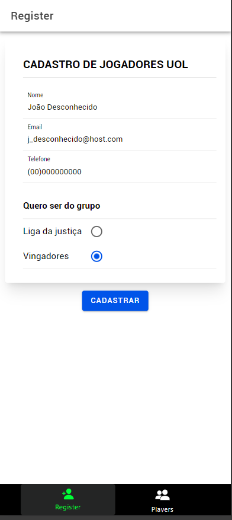
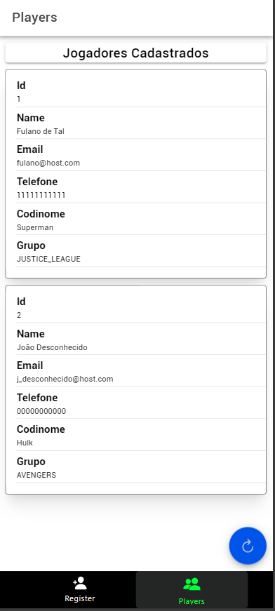

# Desafio backend UOL

Este é um desafio disponibilizado pelo github do UOL em https://github.com/uolhost/test-backEnd-Java

##### O Desafio foi realizado utilizando as seguintes ferramentas:
- Spring Boot
- H2 Database
- JPA

##### Ferramentas usadas no frontend
- Ionic/Angular
- tailwind css
#

#### Como testar o codigo ?
O codigo fonte possui tanto um frontend quanto um backend.

###### iniciar servidor backend:

```
./mvnw spring-boot:run
```

###### Iniciar servidor frontend (Ionic\Angular):

```shell
cd client/playersClient/

ionic serve
```



